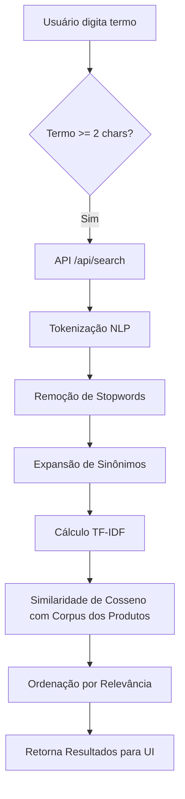
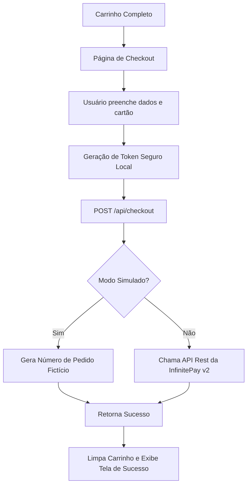

# Documentação - Central do Hardware

Este arquivo existe para cumprir o requisito de entrega da pasta `/docs`.

## Arquitetura do Componente de IA (TF-IDF)

O fluxo de busca inteligente funciona da seguinte maneira:

## Arquitetura do Checkout (InfinitePay)

